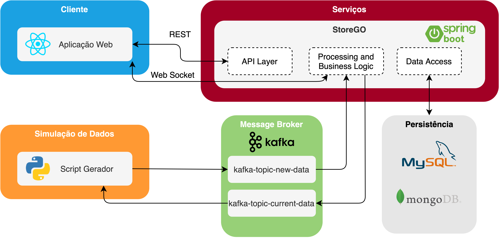

# StoreGO

**Group:** G31

O sistema tem a finalidade de simular a gestão de uma loja automatizada, ou seja, um estabelecimento que proporciona uma experiência de compras sem caixas de pagamento, ao reconhecer os produtos que um cliente retirou da prateleira e efetuar a cobrança no momento em que ele deixa a loja.

Ao chegar ao supermercado é detetada a sua entrada na loja e, através dos sensores distribuídos pelo espaço, são adicionados produtos ao seu carrinho virtual ou removidos se este os voltar a pousar. Terminadas as compras, não é preciso fazer nada: apenas sair da loja. Uma vez do lado de fora da loja a compra é finalizada.

> Todos os dados referidos anteriormente, no contexto da disciplina de IES, são simulados e gerados automaticamente.

Esta aplicação é similar ao supermercado inteligente da Amazon com o conceito “Just Walk Out“, sem filas e sem ​checkouts​.

## Backlog 
Está a ser utilizado o _Jira_ para planear e documentar o projeto. É possível encontrar informação nos links abaixo:

`Jira` (planeamento) https://hugofpaiva.atlassian.net/browse/IES

`Confluence` (documentação) https://hugofpaiva.atlassian.net/wiki/spaces

> [`/Project: IES`](https://hugofpaiva.atlassian.net/wiki/spaces/IES) Pasta do projeto
>
> [`/Iteration 1`](https://hugofpaiva.atlassian.net/wiki/spaces/I1/overview) Documentos relacionados com a iteração 1 

## Aquitetura

### Componentes

- [**Web Application**](./projreact)
